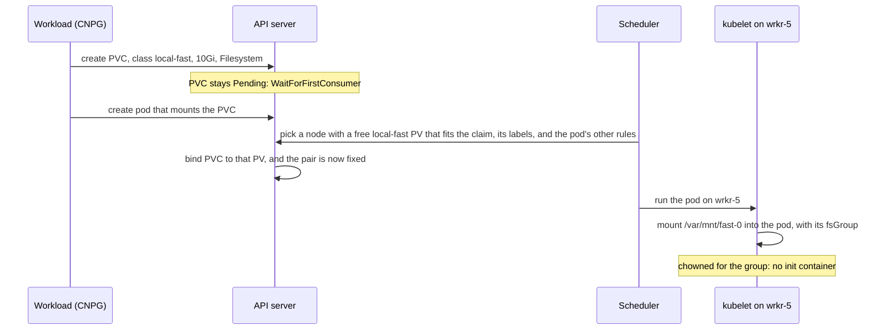
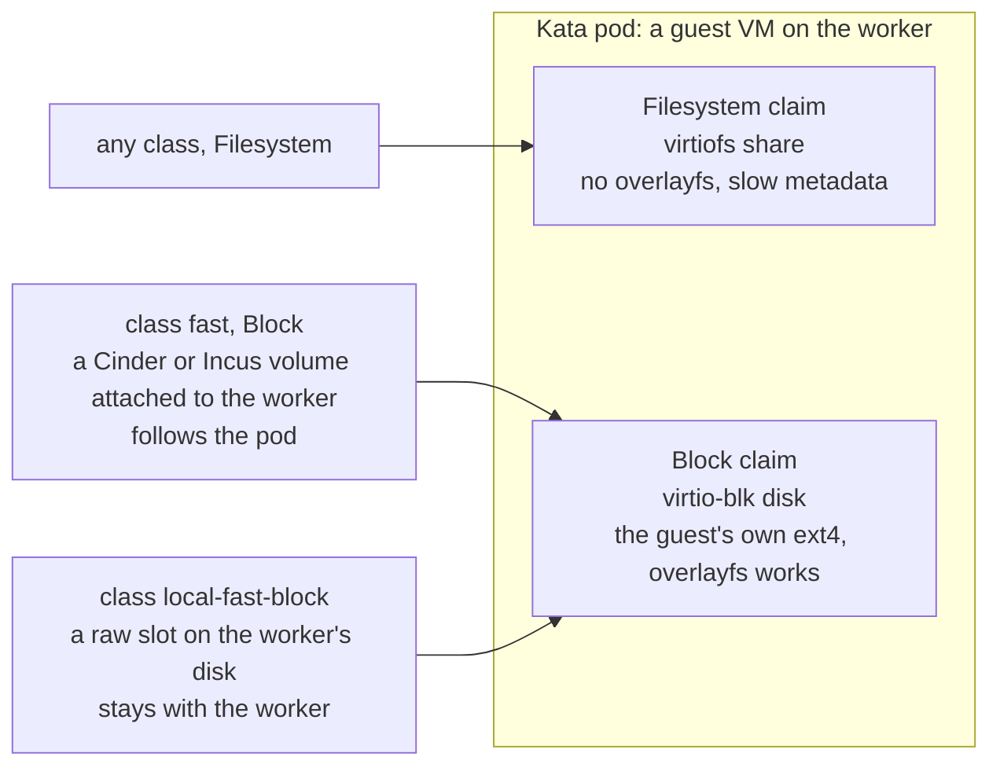
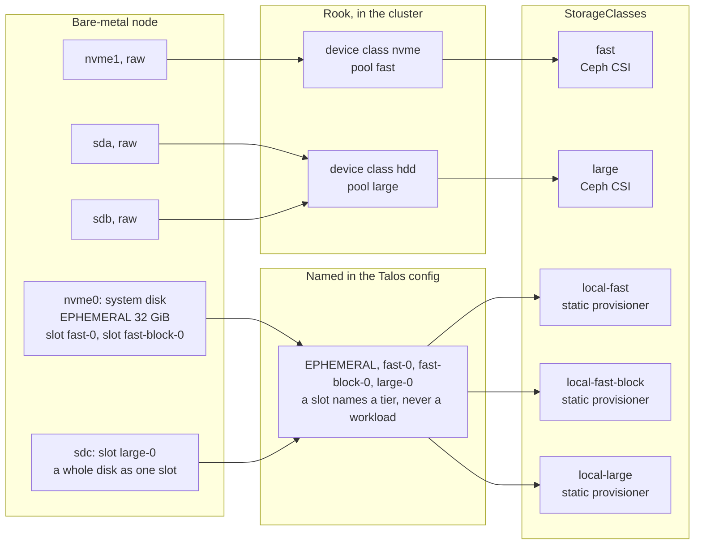
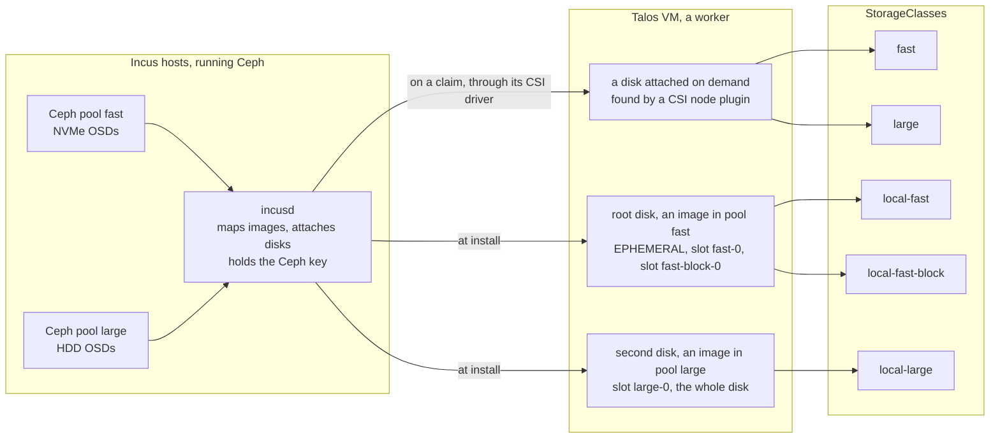

# Node storage

How a disk on a node becomes a volume a workload uses, on three kinds of worker: a cloud machine with one disk, a
virtual machine on Incus with disks from Ceph, and a bare-metal server with several disks. Written for someone who
runs Linux and Ceph and has met Kubernetes storage only from the outside. Decision 025 adopts this design; the
layout of the running cluster is `docs/storage.md`.

## Requirements and goals

- **One manifest, every site.** A workload asks for storage the same way on a cloud worker, an Incus VM and a
  bare-metal server, and the site answers with what it has.
- **Two tiers, `fast` and `large`.** SSD or NVMe against HDD or a standard tier, with the same names whether the
  volume is attached by a cloud or carved from a local disk.
- **Two bindings.** A volume that follows the pod to any node, and a volume that stays on one node for workloads
  that replicate themselves or can rebuild.
- **Kata needs a block device**, from both bindings: a mounted filesystem reaches a Kata guest as virtiofs, where
  overlayfs does not work and metadata is slow (`apps/forgejo-runners/README.md`).
- **Talos provisions a volume once.** A volume's config is applied only while it is unprovisioned; a change after
  that has no effect, and a rename is a removal, a wipe and a new volume, which is data loss and, on a full disk,
  a reinstall. So the config must say nothing about workloads, which come and go at runtime.
- **Ceph wants raw disks.** On bare metal, Rook must find data disks untouched, and nothing in the Talos config
  should have to name them.
- **A slot can be reserved** for one workload when several share a class, without touching the machine.

## Three objects, in Linux terms

Kubernetes separates "there is storage here" from "I need storage" and pairs the two. Three kinds of record do it,
all of them entries in the cluster's API, none of them on a disk:

| Object | What it is | The nearest Linux thing |
|---|---|---|
| PersistentVolume, PV | One piece of storage the cluster knows about: its size, which node it is on when it is local, and which class it belongs to. Made by a provisioner, not by the workload. | A line in `lsblk` for the whole cluster: an inventory entry |
| StorageClass | A name that groups PVs and a policy: which provisioner makes them, when a claim is bound, and what happens to a PV when its claim goes away | A Ceph pool name, or an LVM volume group: the thing a client asks for by name |
| PersistentVolumeClaim, PVC | A request from one namespace: "a volume of this class, at least this big, as a filesystem or as a block device". The cluster binds it to one PV, and the pair stays together until the claim is deleted. | `lvcreate` from a volume group, except that with static PVs it picks a ready-made volume instead of carving one |

A dynamic provisioner, a CSI driver, makes a volume when a claim asks. A static one publishes what already exists:
the local static provisioner is a DaemonSet that watches one directory on every node and makes one PV per mount,
or per block device link, it finds there. It is "the node
announces what it has", and the Talos layout decides what there is to announce.

Three words come up below. `volumeMode` on a claim is `Filesystem`, a mounted directory, or `Block`, a bare device
the pod formats or uses raw. `WaitForFirstConsumer` means a claim is bound when a pod first needs it, so the
scheduler chooses the node and the volume together. `Retain` means a PV whose claim is deleted keeps its data until
a person deletes the PV record.

## The model: a name says binding and tier

A workload asks for storage by one of four class names, and the names mean the same on every kind of node:

| Class | Binding | Tier | For |
|---|---|---|---|
| `fast` | attached: made on demand, follows the pod to any node | SSD or NVMe | a single-instance database, anything that must survive its node |
| `large` | attached | HDD or a standard tier | bulk data: object stores, registries, uploads |
| `local-fast` | local: a slot on one node's own disk, for the node's life | SSD or NVMe | a database that replicates itself, scratch that is rebuilt |
| `local-large` | local | HDD | bulk scratch, a replica of bulk data |

Two things are not in the name because Kubernetes has a word for them already. Filesystem or block is `volumeMode`
on the claim. Who may take a particular local slot is a label on the PV and a selector on the claim, set at
runtime. Reclaim is `Retain` on every class: deleting a claim never deletes data, a person does. A site serves the
tiers it has; a claim for a tier the site lacks stays Pending and says so.

What backs each name on each kind of node:

| Class | osl1, cloud machines | an Incus site, virtual machines | bare metal |
|---|---|---|---|
| `fast` | Cinder CSI, type SSD | Incus CSI, pool `fast`: an image from the hosts' Ceph, attached to the VM | Ceph CSI, pool `fast`: Rook, device class nvme |
| `large` | Cinder CSI, type Standard | Incus CSI, pool `large` | Ceph CSI, pool `large`: Rook, device class hdd |
| `local-fast` | slot `fast-0` on the system disk, the only local disk a cloud machine has | slot on a disk Incus gave the VM from its `fast` pool | slot on an NVMe disk |
| `local-large` | none | slot on a disk Incus gave the VM from its `large` pool | slot on an HDD |

An attached class is a CSI driver and a parameter: a Cinder volume type at osl1, an Incus pool on an Incus site, a
Ceph pool on bare metal. For a Ceph engineer the tier is familiar: a CRUSH device class, a rule, a pool, and the
pool's name is the class's name. A local class is a slot on a disk the node owns, published by the static
provisioner, and the tier comes from the disk the slot is on.

## A slot: what Talos fixes, what Kubernetes sets

Talos names a slot by tier and number, `fast-0`, `large-0`, and says how big it is and which disk it is on. The
binding word, `local`, is added by Kubernetes in the class name, since a slot is local by nature. Who uses a slot
lives in Kubernetes, where an API call changes it. A slot has one of two forms, chosen when it is laid out, and
each form is one Talos volume type and one Kubernetes volume mode:

| Form | Talos | On the node | Published as | For |
|---|---|---|---|---|
| filesystem slot `fast-0` | `UserVolumeConfig`, xfs | partition `u-fast-0`, mounted at `/var/mnt/fast-0` | class `local-fast`, `Filesystem` | ordinary pods; the kubelet sets the pod's group on the mount, so a non-root database needs no init container |
| block slot `fast-block-0` | `RawVolumeConfig`, no filesystem | partition `r-fast-block-0`, a link under `/dev/disk/by-partlabel` | class `local-fast-block`, `Block` | Kata pods, and anything that formats its own disk |

The block form has its own class because the static provisioner reads one directory in one mode per class: mounts
under `/var/mnt`, or device links under `/dev/disk/by-partlabel`. `large-block-0` and `local-large-block` follow
the same rule. Attached classes need no split, since a CSI
driver serves both modes from one class. The disk selector names the disk, never the workload. On a node whose
disks are never swapped, the kind is enough: `system_disk`, `disk.transport == 'nvme'`, `disk.rotational`. On a
node with bays, a slot on a data disk selects the bay, `'/dev/disk/by-path/pci-0000:00:1f.2-ata-1' in
disk.symlinks`, because a selector by kind would also match a blank disk inserted for Ceph: Talos locates an
existing volume or provisions a new one on the first matching disk with room, so a missing slot would land there.

With one class per tier, a claim is matched to a free PV by class, mode and size, and the first claim wins. That is
fine while one workload uses a class. When two share it, two databases on their own slots say, the reservation is
made at runtime: a label on the PV, `dataverket.org/reserved-for`, and a
selector on the claim that names it. CNPG's claim template carries such a selector, and `kubectl label` sets and
unsets the label. Here is how a claim meets a slot:

The claim, once bound, stays bound. If the node dies, the pod stays Pending on a PV that is gone. A replicating
database handles that by having the instance deleted, so the operator joins a fresh one on the new node, bound to
the new node's slot; the procedure is in `docs/storage.md`. When two workloads share the class, that procedure
gains one step: label the new node's PV before the new instance claims it.

## Kata: a block device or nothing

A Kata pod is a small virtual machine, and a volume has to cross into it. A Filesystem claim arrives as a virtiofs
share of the host's mount, where overlayfs fails and metadata is slow. A Block claim arrives as a virtio-blk disk,
and the guest runs its own filesystem on it. So a Kata pod asks for `volumeMode: Block`, whatever the class, and
both bindings have a block answer:

A runner's image store on `fast` survives the worker; the same store on `local-fast-block` is faster and is lost
with the worker, which for a cache is the right trade.

## Bare metal: raw disks belong to their consumer

A bare-metal node has a system disk and some number of data disks. Talos partitions only where a volume config
sends it, and its own volumes default to the system disk, so every other disk stays raw, with no partition table
and no filesystem, as a Ceph engineer wants to find it; the lab's second disk carried nothing but the two slots
named for it.
Rook takes those disks by name or by filter, puts each OSD in a device class, nvme or hdd, and a CRUSH rule per
class makes the pools `fast` and `large`. Ceph CSI turns each pool into the attached class of the same name.
Nothing in the Talos config names a Ceph disk. Slots take the system disk, and a data disk only where it should be
a plain local volume rather than an OSD.

### Replacing a disk

Rook selects its disks by bay as well, a `devicePathFilter` on `/dev/disk/by-path`, so after a swap each side
finds its own disk and neither can take the other's. Three cases, none of which changes anything in git:

- **A Ceph disk.** Mark the OSD out and purge it, swap the disk, and Rook makes a new OSD from the blank disk. A
  disk that was used before carries partitions Rook refuses; `talosctl wipe disk` clears it, which is the Talos
  form of zapping. It refuses a device that is a Talos volume, so a slot's partition is wiped only after its
  config is removed, or by a reset that names the volume.
- **A slot disk.** Talos lays the slot out again on the replacement, empty, at the same path, and the provisioner
  republishes it under the same PV name, since the name is a hash of node, class and path. A claim bound to the
  old PV would mount the empty slot without a word. So a replaced slot disk is handled like a replaced node for
  the claims on it: destroy the instance that used it, delete the PV record, let the slot republish, label it if
  the class is shared, and let the operator join a fresh instance. For a database that replicates itself this is
  the same procedure as a worker replacement in `docs/storage.md`.
- **The system disk.** A reinstall, which is the worker replacement path.

## Incus: a VM whose disks are Ceph images

On an Incus site the hosts run Ceph, and Incus keeps its storage pools in it: a VM's root disk is an RBD image the
host's kernel maps and hands to QEMU, and any further disk Incus gives the VM is another image. Inside the Talos VM
they are plain disks, and nothing in the VM talks to Ceph. From Talos the picture is the Cinder one: a disk is
either there at install, and carries slots, or it is attached on demand by a CSI driver that asks Incus for a
volume in a pool, and that is an attached class. The driver is not this page's subject; what matters here is that
it hands the VM a disk, as Cinder does on a cloud worker.

A disk given at install belongs to the VM for the VM's life, which is why its slots are local: the root disk
carries EPHEMERAL and a slot or two, and a disk added from the `large` pool carries `large-0`.

The three pictures are one picture. Attached is a disk that arrives on a claim and leaves with it: Cinder at osl1,
Incus on an Incus site, Ceph CSI over Rook's pools on bare metal. Local is a slot on a disk the node had at install,
and on Incus the disk happens to be an image.

## Tested

The model ran on a lab cluster on 2026-10-05, Talos 1.14.2 with the Kata extension in QEMU: slots laid out by tier
on two disks, the second one picked by its serial; four classes from one provisioner; non-root pods on filesystem
slots; a block slot as a device in an ordinary pod and as a virtio-blk disk in a Kata pod; a filesystem slot as
virtiofs in a Kata pod; a released PV republished and reserved by label. The run, with its output, is
`docs/research/2026-10-node-storage-lab.md`. Two rules for the provisioner's configuration came out of it:

- A second class over the same directory needs its own container path, `mountDir`, since the DaemonSet mounts
  each class's directory and two mounts at one path are rejected. The PVs keep the host path.
- For a Block class that container path must sit at the same depth as the host directory, `/dev/disk/<name>`,
  because the partition labels are relative links into `/dev` and the provisioner resolves them where it reads them.
