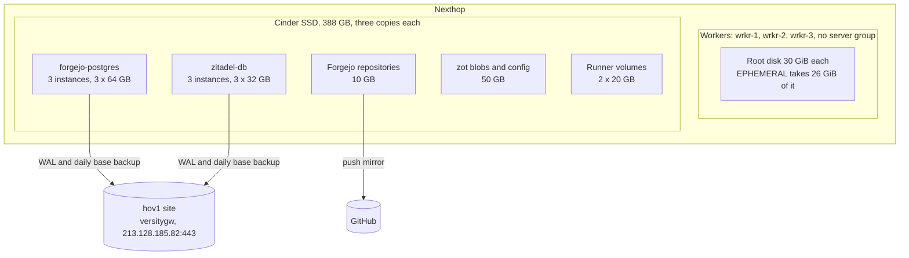
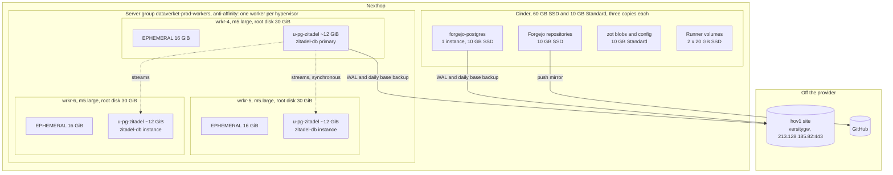

# Plan: storage building blocks

Written 2026-09-19 from live inventory (swamp models `dataverket-prod-pvcs`, `openstack-*`, `omni` and
`dataverket-prod-talos`) and the Nexthop price list of the same day. Fourth revision, 2026-09-20: the workers are placed in a Nova
anti-affinity server group and replaced through Omni one at a time, never reset in place; the new disk layout
arrives with the new machines. Fifth revision, 2026-09-20: backups go to the hov1 site, `213.128.185.82:443`, a
versitygw with the posix backend in Docker (`backup/versitygw`, instantiated as `backup/hov1`), instead of Nexthop
Object Storage; the
in-cluster versitygw kept its role until the eighth revision. Reviewed adversarially again the same day; what it found
(the admin API signs with the region, the sops rule path, SIGHUP reloads versitygw's certificate, versioning without
lifecycle, the WAL rate) is folded in. Sixth revision, 2026-09-30: step 1 is applied except the repositories,
whose copy is the push mirror to GitHub for now and kopia, not restic, when they get one of their own; the
secrets a restore needs are pinned in `*.enc.yaml`. Steps 2 to 6 are not applied. Seventh revision, 2026-09-30:
only Zitadel's database moves to the worker disks, which stay m5.large; Forgejo's, Zulip's and every later
database is one instance on one Cinder volume. Decision 014 is the mechanism under Zitadel's database.

Eighth revision, 2026-09-30: the savings come first and the local disks after. Forgejo's database moves on its
own right after step 1, since it is most of the saving and needs no new worker; zot moves to a Standard volume next.
The in-cluster versitygw leaves this plan: it saved nothing and waits for a writer that needs S3, Zulip's uploads
or Forgejo's LFS. Zitadel's database on the worker disks is said for what it is, a rehearsal for bare-metal
nodes with NVMe, where local disks are the only disks; against three 10 GB Cinder volumes it saves 60 NOK a month.
Replacing a worker that holds a replica is the part of that rehearsal this plan does not run; it is
`docs/plans/2026-09-worker-replacement-test.md`, for later. Steps 2 to 7 are not applied.

Ninth revision, 2026-09-30: every step names the files it changes, so that git, not swamp's data, describes the
cluster at each "stopped here", and Flux could rebuild it from the repository (building block 7). What a step
does by hand is scaffolding that leaves nothing git does not describe. The Talos patch becomes a file, each
database's `bootstrap.recovery` stays in git so a rebuild restores from the hov1 site, and "Rebuild from git"
says what comes back and what does not, with the GitHub mirror as Flux's source while Forgejo is gone.

## Building blocks

1. **One redundancy layer per kind of data.** Zitadel's database replicates itself: CNPG runs three instances,
   one per worker, on a partition carved from each worker's root disk, with one synchronous replica so a failover
   loses no acknowledged commit. Those disks are paid for with the flavor. Every other database, Forgejo's,
   Zulip's and later ones, is one CNPG instance on one Cinder volume, like the other single-writer and blob-shaped
   data (registry, repositories, runner caches): Cinder keeps three copies, and a failover is a volume reattach,
   minutes rather than seconds. Nothing replicates on top of Cinder.
2. **EPHEMERAL is a fixed 16 GiB on the workers**, 32 GiB at most anywhere else. Talos sizes a volume only when
   it first provisions it, and by default EPHEMERAL takes the whole disk; a cap turns the kubelet's percentage
   thresholds into a budget. `maxSize` accepts a percentage, but a share of the disk is the wrong unit across
   30 GiB and 1 TB disks.
3. **Local disks are rehearsed here and used on bare metal.** A Talos user volume on the system disk, published
   as a `local` PV by the static provisioner (decision 014), holding a database that replicates itself. Zitadel's
   is the one: small, append-only, mostly read from memory, and restored from the hov1 site in a test. What is
   learned here carries to NVMe nodes unchanged, except the disk selector if those nodes have a data disk of
   their own.
4. **Backups leave the provider.** The target is `213.128.185.82:443`, a versitygw with the posix backend in Docker
   at the hov1 site (`backup/hov1`), reached by address so that no zone, name or DirectAdmin sits in the backup
   path: a different building, a different network, a different operator's mistakes. Cinder and Nexthop Object
   Storage share the account's blast radius, so neither is the copy that matters. The price is availability: the
   site's uplink is down more often than a provider's, so every writer must tolerate hours of that, and the WAL
   alert below is what makes an outage cheap instead of fatal.
5. **Tier by shape.** SSD for databases, working trees and caches, Standard for blobs.
6. **Placement is declared, not observed.** The workers are members of a Nova anti-affinity server group, so no
   two share a hypervisor, and a worker that cannot be placed fails to boot instead of landing beside a sibling.
   Nova sets membership only at boot, so a machine gets into the group by being created in it; a worker's disk
   layout, which Talos likewise fixes at first provisioning, arrives the same way. A worker is never changed in
   place, it is replaced.
7. **Git describes the cluster; Flux could rebuild it.** Every step ends with the cluster matching the
   repository, and each step's **Git** paragraph lists the files. A suspend, a scale, a copy, a PV patch or a
   one-off Job is scaffolding: done by hand, gone when the step ends, and never the only record of anything.
   Swamp's models do what Flux cannot, below Kubernetes (servers, the server group, Omni) and reads for checks;
   what they apply comes from a file in git, not from an argument typed once. A database that git describes
   carries `bootstrap.recovery`, so a rebuild restores it from the hov1 site instead of starting empty.

## Before and after

Before step 2, 2026-09-30 (steps 1 to 3 are applied): every volume a Cinder SSD, and each database keeping
three copies of itself on three volumes that Cinder copies three times again.

After step 6: new workers, one per hypervisor, carry Zitadel's database on their own root disks; Cinder keeps
every other database and what is single-writer or blob-shaped, and zot's blobs are on the cheaper tier.

Zitadel's primary and synchronous replica are wherever CNPG puts them; the drawing shows one arrangement, and
`method: any` lets either replica be the one that acknowledges. Zulip's database, when it comes, is one more
single instance on its own Cinder volume. Where Zulip's uploads and Forgejo's LFS and packages go, an in-cluster
S3 or a volume, is decided with Zulip; kopia copies the repositories to hov1 later.

## Measured

`swamp workflow run fleet-volumes` (omni mints a talosconfig with the node list, `dataverket-prod-talos volumes`
reads the machines through Omni's proxy); the same talosctl model gives a lab cluster the same view. Today:

| Node | System disk | Partitions | EPHEMERAL | Used | Unallocated |
|---|---|---|---|---|---|
| ctrl-1..3 | 25 GiB | STATE 100, BIOS 1, BOOT 2000, META 1 MiB | 21,495 MiB | 1.1 GiB, 5% | 2,003 MiB |
| wrkr-1, wrkr-2 | 30 GiB | same | 26,615 MiB | 5.5 GiB, 21% | 2,003 MiB |
| wrkr-3 | 30 GiB | same | 26,615 MiB | 8.4 GiB, 33% | 2,003 MiB |

Usage is almost entirely container images; logs are under 105 MiB. At 16 GiB the busiest worker sits at 52
percent, with image collection from 80. Every disk already has 2 GiB unallocated that EPHEMERAL never took.

**The worker disk after the change**, 30 GiB on m5.large: 2,102 MiB of Talos partitions, EPHEMERAL 16,384 MiB,
and the remaining 12,234 MiB all for `u-pg-zitadel`, at least 6 GiB and grown into the rest. WAL is budgeted at
1.5 GiB (`max_wal_size` 1 GB plus 512 MB retained by replication slots), leaving about 10.5 GiB for data,
seventeen times today's 620 MB. Zitadel's append-only event store grows slowly and predictably at this size, it
mostly reads from memory, and it writes a few events per login, so image pulls and CI on the same 500 IOPS slow
it without stalling it. Forgejo's database stays on Cinder: its growth follows issues, pull requests and CI, it
writes most while CI is busiest, and its repositories volume keeps Cinder in its failover path anyway. A larger
flavor was weighed on 2026-09-30 for Zulip's memory and a third partition, and not taken: 8 GB holds today's load
with room for Zulip, and a flavor change is three swaps whenever it is wanted.

## Placement, and the open question of where the root disks are

Nexthop documents three copies for volumes and nothing for flavor disks. Ask whether flavor root disks are
hypervisor-local or replicated, and whether instances live-migrate. The plan does not depend on the answer: the
disk is paid for either way, and CNPG replicates for failover, not durability. What it does depend on is three
workers on three hypervisors, and today nothing says they are: every server record shows `serverGroups: []`, and
until 2026-09-20 the server model did not record `hostId`, the per-project hash Nova shows a tenant. It does
now, and the seven servers show exactly three values, one control plane and one worker on each: the workers
already sit on three hypervisors, and three is what this project can see. The group turns that from what the
scheduler happened to do into what it must do. Nova honours a server group
only at boot and has no call that adds a running server to one, so the workers are placed by being recreated,
which is step 4. Building block 6.

## Cost

Prices, NOK per GB-month ex VAT: SSD 1.99, Standard 0.89, Object 0.49 at no commitment; 1.49, 0.69, 0.33 at the
5000 NOK/month tier; the invoice says which applies.

| Layout | Cinder | NOK/month (no commit / top tier) | Saved |
|---|---|---|---|
| Today | 388 SSD | 772 / 578 | |
| 1. After step 2: Forgejo's database one 10 GB volume | 206 SSD | 410 / 307 | 362 / 271 |
| 2. After step 3: zot on a 10 GB Standard volume | 156 SSD + 10 Std | 319 / 239 | 453 / 339 |
| 3. After step 6: Zitadel on worker disks | 60 SSD + 10 Std | 128 / 96 | 644 / 482 |

Layout 3 against the same Zitadel on three 10 GB SSD volumes is 60 / 45 a month: that is what the rehearsal
saves, and it is not why it is done. Backups cost nothing per month, the hov1 site is paid for; measure the
archive's size and the WAL rate after a week anyway, they size the site's disk and say how long an outage the
budget survives. zot's old SSD volume was deleted the day it was replaced, so it added nothing. Zulip's database adds its own volume,
sized when it is installed. Step 4 runs one extra m5.large for the hours each swap takes, three times, a few NOK
in total.

## Steps

Each step has a check and a "stopped here" state. Step 1 needs the author (a YubiKey recipient in `.sops.yaml`);
a stand-in can do the rest once it is merged, except the zot artifact push in step 3, which is the author's.

1. **Backups first.** The target is the hov1 site: `backup/versitygw` is a compose stack that names no site (versitygw,
   posix backend, `--versioning-dir` outside the root, nothing else running), and `backup/hov1` is its
   first instance, an `.env` and a directory, at `213.128.185.82:443`; TLS is from the site's own private CA, four
   files made offline with `step`, root and certificate valid three years, since no public CA issues a durable
   certificate for a bare address and one gateway does not justify a running CA. Its README is the runbook. On it one bucket
   and one account per writer, `cnpg-forgejo`, `cnpg-zitadel`, later `kopia-forgejo`, each account the owner of its
   bucket and of nothing else; the root key mints accounts and is held by no automation. The account reaches the
   cluster through sops and nothing else: `bin/user` prints the Secret manifest, it is piped from the repository
   root through `sops --encrypt --filename-override apps/<namespace>/s3-<bucket>.enc.yaml` (the override is what
   matches the cluster-files rule) into that file, in clear only in the gateway's IAM store and in the shell for
   the seconds it takes; Flux decrypts it with the cluster key like every `*.enc.yaml`, and the writer reads it by
   name. The site's public facts, root, endpoint and region, come in clear as `apps/<namespace>/hov1-s3.yaml`
   from `bin/site-secret`, so an address change is a plaintext diff. Both files are listed in the namespace's
   `kustomization.yaml`. Nothing goes into the `infra` vault until a workflow needs it (decision 006); rotation is
   `bin/user --rotate` and a commit at once, since the writer fails from the delete until the new Secret lands.
   Bucket versioning stays off: versitygw 1.8 has no lifecycle rules, so it would keep every deleted object
   forever, and an account that owns a bucket can suspend it anyway; retention is the writers' job, and the second
   copy below is what protects the archive from a bad writer, object lock the upgrade if it is ever wanted. CNPG
   Barman Cloud plugin (the in-tree `barmanObjectStore` is deprecated): per cluster an `ObjectStore` with
   `endpointURL` on the site's address (boto picks path-style for an address by itself), `endpointCA` from the site
   Secret, `s3Credentials` and their `region` from the account and site Secrets, gzip compression, and a distinct
   `serverName` in the Cluster's plugin parameters, daily `ScheduledBackup`, continuous WAL, 14 days. The
   repositories' copy is the push mirror to GitHub for now; when they get one of their own it is kopia of
   `gitea-shared-storage`, pod-affine to the forgejo pod, to a `kopia-forgejo` bucket. A restore needs the application
   secrets, so the Zitadel masterkey (`apps/zitadel/zitadel-masterkey.enc.yaml`) and Forgejo's generated
   `SECRET_KEY`, `INTERNAL_TOKEN`, `JWT_SECRET` and `LFS_JWT_SECRET` (`apps/forgejo/forgejo-security.enc.yaml`,
   pinned into the release, since Forgejo writes them into `app.ini` on the repositories' volume and the mirror
   does not copy it) go into `*.enc.yaml` first; the vault gets a copy the day a workflow restores (decision 006).
   Then a restore test of both clusters into a scratch cluster beside each (`backup/restore-test/`, `bootstrap.recovery` via
   `externalClusters[].plugin`, a new `serverName` for the restored cluster's own archive), timings recorded: the restore test measures the site's uplink, and the base backup's transfer time is the number to
   know before an outage. Check: `psql` on each restored cluster shows the application tables. Stopped here: proven
   backups, off the provider. If the hov1 site proves unreachable too often, a second copy to Nexthop Object
   Storage is the same mechanism with a second `ObjectStore`, not a new plan.
2. **Forgejo's database to one instance on one Cinder volume.** A migration from the archive, which is also a
   second restore test. Forgejo is where Flux reads this repository, so the change lands on `main` while Forgejo
   still runs, and Flux is held off until the database is back: `flux suspend kustomization apps` and
   `flux suspend helmrelease forgejo -n forgejo`, since a helm upgrade during the restore would start Forgejo
   against a Secret that is gone. Then push the new `Cluster` to `main`: the same name, so the `-rw` Service and
   `-app` Secret keep theirs; `instances: 1` on `csi-cinder-sc-delete` with `storage.size: 10Gi`,
   `max_wal_size: 1GB`, and `enablePDB: false` so that a drain moves it instead of blocking on it; `imageName`
   pinned to the archive's Postgres major; `bootstrap.recovery` from `externalClusters[].plugin`
   (`barmanObjectName: hov1`, `serverName: forgejo-postgres`) with `recovery.database` and `recovery.owner` set
   (recovery does not inherit `initdb`'s names); and a new `serverName` in the plugin parameters, so the restored
   cluster archives beside the old one instead of over it. Now scale Forgejo to zero (git is down for the restore
   time from step 1); final backup (`kubectl cnpg backup forgejo-postgres --method plugin --plugin-name
   barman-cloud.cloudnative-pg.io`); patch the cluster's three Cinder PVs to `Retain`; delete the `Cluster`; wait
   until `kubectl get pvc -l cnpg.io/cluster=forgejo-postgres` is empty; apply the new `Cluster` from the commit
   by hand (`git show main:apps/forgejo/postgres.yaml`), since Flux cannot fetch while Forgejo is down. Once it
   is ready and before anything writes to it, the first base backup by hand, with the same command as the final
   one, and wait for it to complete: whether or not the ScheduledBackup's `immediate` run fires again, this is the
   backup known to exist before Forgejo writes. Then scale Forgejo up, which reads the regenerated Secret's new
   password; resume the HelmRelease; check that the GitRepository's revision is the commit; resume `apps`.
   Check: one instance on a 10 GB volume, a login and a push work, the backup completed under the new
   `serverName`; then delete the three retained PV objects and, after `openstack-volume get` on each ID (rule 5),
   their Cinder volumes. The old `serverName` in `cnpg-forgejo` is the way back for 14 days, then deleted by hand,
   since retention trims only the current one. Stopped here: layout 1.

   **Git.** First commit, `apps/forgejo/postgres.yaml`: `instances: 1`, `storage.storageClass:
   csi-cinder-sc-delete` said rather than defaulted, `storage.size: 10Gi`, `enablePDB: false`,
   `postgresql.parameters.max_wal_size: 1GB`, `imageName`, `bootstrap.recovery` in place of `initdb`, an
   `externalClusters` entry `hov1` with the plugin and `serverName: forgejo-postgres`, and the plugin parameters'
   `serverName: forgejo-postgres-2`. Second commit, the same day the first backup completes: the
   `externalClusters` entry reads `forgejo-postgres-2`, so the recovery source is always the archive the cluster
   writes; until it lands, a rebuild would restore the state of the migration and lose what came after. CNPG
   reads `bootstrap` and `externalClusters` only when it creates a cluster, and `kubectl apply --dry-run=server`
   on that commit shows the webhook accepts it on a running one. After 14 days, with the old folder deleted, a
   third commit removes `forgejo-postgres-first` from `apps/forgejo/backup.yaml`. The first backup is not
   committed: a `Backup` in git is applied with the `Cluster` on a rebuild, fires while the instances recover and
   fails, as the one of 2026-09-20 did, and is never retried.

   **Applied, 2026-09-30.** The first commit was prepared on branch `storage-step-2` (`apps/forgejo/postgres.yaml`,
   image `18.4-system-trixie` as the running instances and the restore test, `hov1-archive` as the recovery
   source like `backup/restore-test/`) and landed as `23a375f`. Checked against CNPG 1.30.0 and plugin
   v0.15.0: a server-side dry-run create of it passes; the webhook refuses it on the running cluster (storage
   cannot shrink from 64Gi, and two bootstrap methods), so a Flux apply before the delete fails and changes
   nothing; `forgejo-postgres-daily` has no owner reference, so it survives the delete, and its `immediate` run
   has fired. The run: Forgejo down from 13:49:40 to 13:53:25 UTC; the final backup took 5 seconds, the
   recovery 52, the first backup under `forgejo-postgres-2` 20; the restored cluster held every table, the last
   action from 13:49. Both backups were `Backup` objects applied by hand (`forgejo-postgres-final`,
   `forgejo-postgres-2-first`), since no `kubectl cnpg` plugin is installed. The recovery-source commit is
   `d84928c`. Checks passed: a login through Zitadel, a push, `database:ping`, archiving to `forgejo-postgres-2`.
   The three 64 GB volumes were deleted the same day after `openstack-volume get` on each ID; Cinder holds 206 GB
   of SSD, layout 1. Left for 2026-10-14: the `forgejo-postgres` folder in `cnpg-forgejo` deleted by hand and
   `forgejo-postgres-first` removed from `apps/forgejo/backup.yaml`.
3. **zot to a Standard volume.** A `csi-cinder-standard-retain` class beside the other two in
   `infrastructure/cinder-csi-provider/storageclass.yaml` (`parameters.type: Standard`, the Cinder type's name as
   `openstack-volume-type` records it; `Retain`, expansion allowed). The new claim is 10 GB: on 2026-09-30 zot
   held 44 MiB in 55 files, none hardlinked, on its 50 GB volume (measured from a read-only busybox pod on the
   same node, through `zot-pods`, since zot's image has no shell), and a Cinder volume grows online. zot's storage is files on a
   filesystem before and after, so the move is a copy, not a sync, and `dedupe` makes hardlinks that only one
   GNU `cp -a` keeps: a Debian image, not busybox, run as 1000:1000 with `fsGroup: 1000` like zot. Suspend the
   zot Kustomization and scale the StatefulSet to zero; outside pulls through `registry.dataverket.org` fail from
   here until it is back, and nothing under `apps/` pulls from zot. Create a claim `zot-standard` on the new
   class; a Job mounting both claims runs `cp -a /old/. /new/`; compare `du -sh` and `find -links +1 | wc -l` on
   both sides. Delete that claim (its PV is kept by `Retain`) and clear the PV's `claimRef`; delete `data-zot-0`
   (the old PV is kept the same way); create `data-zot-0` again with `volumeName` on the new PV,
   `storageClassName: csi-cinder-standard-retain` and a size no larger than the PV's. The StatefulSet's
   `volumeClaimTemplates` cannot change in place, so change the class and size in
   `artifacts/zot/statefulset.yaml`, delete the StatefulSet, and apply from git explicitly with
   `bootstrap/zot-from-git.yaml` (`bootstrap.sh` skips its git path while the suspended Kustomization reports
   Ready). Then `artifacts/zot/push.sh` and `flux reconcile source oci zot-config -n flux-system`, so the
   Kustomization does not resume onto the cached artifact with the old template; resume, and delete
   `zot-bootstrap`. Check: a pull through the Service succeeds, and `openstack-volume get` shows the claim's volume
   as `Standard`. Delete the old volume after a month. Stopped here: layout 2.

   **Git.** `infrastructure/cinder-csi-provider/storageclass.yaml` gains the class, first and on its own, since it
   creates nothing. `artifacts/zot/statefulset.yaml`: `volumeClaimTemplates` on `csi-cinder-standard-retain` at
   `10Gi`; the artifact pushed from it is the same directory. The claim rebound by hand matches that
   template, so git describes it. The copy Job and the temporary claim are scaffolding and stay out. A rebuild
   gives zot an empty Standard volume, which the Backups section already accepts.

   **Applied, 2026-09-30.** The class landed as `54cb0eb`, the template as `fdbda9d`. zot was down from 16:04:59
   to about 16:08 UTC. With no hardlinks to keep, the copy Job ran busybox, the image already on wrkr-1, and
   skipped `lost+found`: 55 files on both sides, every md5 checksum equal. The rebound `data-zot-0` is PV
   `pvc-beca8c2d-…`, Cinder volume `ed197971-…`, 10 GB `Standard`, whose CSI metadata still names the temporary
   claim `zot-standard`, from when it was created; it is zot's volume, not a leftover. The artifact from `fdbda9d`
   was pushed, the zot Kustomization resumed onto it without recreating the StatefulSet, and `zot-bootstrap` was
   deleted. Checks passed: Flux pulled `zot-config` through the Service, `registry.dataverket.org/v2/` answered.
   The old 50 GB SSD volume, `bab66a9d-…` (PV `pvc-f31756c6-…`), was deleted the same day after
   `openstack-volume get` on its ID, instead of kept a month: 44 MiB of rebuildable blobs were not worth 100 NOK
   as a way back. Cinder holds 156 GB of SSD and 10 GB of Standard. Stopped here: layout 2.
4. **Worker placement and disk layout, by replacement.** Talos sizes EPHEMERAL and provisions user volumes only
   when it first provisions a machine, and Nova sets server-group membership only at boot, so both arrive the same
   way: a new worker, created in the group, provisioned by Omni with the patch already on it. Three swaps, one
   worker at a time, never fewer than three workers in the cluster. Nothing is reset in place and no rehearsal
   cluster is needed: this is the path the existing workers took on 2026-09-07, from the same image, plus a
   group and a patch. The Omni side is four methods of the `omni-cluster` model (`@dataverket/omnictl/cluster`,
   the Operator service account `fabrikk-infra-omni-cluster` on its own vault key,
   `omni/operator_service_account_key`; the Reader `fabrikk-infra-omni` stays on `omni`): `applyPatch` writes a
   machine-scoped `ConfigPatch` (label `omni.sidero.dev/machine: <uuid>`, id `500-<hostname>-storage`);
   `addMachine` writes the `MachineSetNode` (id the machine's UUID, labels `omni.sidero.dev/machine-set:
   dataverket-prod-workers` and `omni.sidero.dev/cluster: dataverket-prod`), which is what the UI's "add machine"
   creates; `removeMachine` is `omnictl cluster machine delete <uuid>`, which drains, wipes and waits;
   `forgetMachine` deletes the retired machine's `Link` and refuses while it is in a cluster. The first
   `applyPatch` and `addMachine` run with `dryRun=true`, so Omni validates both resources with the new key before
   anything is written.

   Once, before the first swap: `openstack-server-group create` with `name: dataverket-prod-workers` and
   `policy: anti-affinity` (an existing name is reused; no `maxServerPerHost`, so one member per host). And the
   patch, written once and applied as a machine-scoped Omni `ConfigPatch` to each new machine before it joins,
   not to the machine set: `VolumeConfig` EPHEMERAL with `maxSize: 16GiB`; `UserVolumeConfig` `pg-zitadel`
   (`diskSelector.match: system_disk`, `minSize: 6GiB`, `grow: true`, xfs); kubelet `extraConfig` with `imageGCHighThresholdPercent: 80`,
   `imageGCLowThresholdPercent: 70`, `imageMaximumGCAge: 168h`, `containerLogMaxSize: 20Mi`, `evictionHard`
   `imagefs.available: 2Gi` and `nodefs.available: 1Gi`. The patch is a file,
   `talos/dataverket-prod/workers-storage.yaml`, outside `clusters/` so Flux never reads it, and `applyPatch` is
   given its contents; the stored `configPatch` is a copy, not the source. `system_disk` is what keeps Talos off the Cinder disks
   attached to the same machine, so it is checked in the patch before anything else is. The old workers must
   never see the patch: a user volume a running machine cannot fit is a state this plan has not proved harmless,
   and a machine-scoped patch is the guarantee. After the third swap the same patch moves to the workers machine
   set, where every member already matches it, so a future worker inherits it.

   Per swap, new machine first, old machine last, so every step before the last leaves the old worker untouched:
   1. `openstack-server create`: `name` the next free `dataverket-wrkr-N` (4, 5, 6; nothing keys on the names),
      `flavor: m5.large`, `image: dataverket-omni-talos-amd64`, `networks: [infra1-net]`,
      `securityGroups: [default]`, `serverGroup: dataverket-prod-workers`, its siblings' description. The image
      carries the Omni join token of 2026-09-07, so the machine appears in Omni unallocated, provided that token
      is still active: `omni joinTokens` before the first create (2026-09-30: one token, active, default, six
      machines joined, no expiry), and a new image from the current default token if it is not. A create that fails with no valid
      host is the group doing its job: the zone has no free hypervisor, and that is a conversation with Nexthop
      before a `soft-anti-affinity` retreat.
   2. `omni-cluster applyPatch` for the machine, then `omni-cluster addMachine` into `dataverket-prod-workers`;
      the stored `configPatch` and `machineSetNode` are the record. Omni installs Talos: EPHEMERAL at 16 GiB,
      the user volume behind it, the kubelet thresholds. The node joins.
   3. Check: `fleet-volumes` shows the new node with EPHEMERAL 16,384 MiB and `u-pg-zitadel` of about 12 GiB,
      and every Cinder disk on it untouched; `omni discover` shows it running in the workers machine set with
      `siderolabs/kata-containers` among its extensions; `openstack-server get` shows the group under
      `serverGroups`, a `hostId` unlike the other new workers', and the load balancers' `lb-sg-*` groups, which
      OCCM adds to members by itself; the node is Ready. Anything else: stop, the old worker is untouched and the new one is deleted.
   4. Retire an old worker, in any order, since every volume is still on Cinder: promote Zitadel's primary away
      if it is there (`kubectl cnpg promote`; the primary's PodDisruptionBudget blocks a drain), cordon and
      drain; every pod on it is Cinder-backed or stateless and reattaches elsewhere, Forgejo's database and zot
      down for the minutes their volumes take. `omni-cluster removeMachine`, which wipes it and returns it
      to the pool. `openstack-server get` must show `volumesAttached` empty; then `openstack-server delete` by ID
      (rule 5); only then `omni-cluster forgetMachine`, because a wiped machine that is still running
      re-registers the moment its entry goes. Then `swamp workflow run fleet-volumes`, so the talosconfig record
      carries the new node list.

   Check after the third swap: three workers, `serverGroups` non-empty on each, three distinct `hostId` values
   across them, which is the placement the group promised, observed; the patch on the machine set. Stopped here: an empty user volume on each of three placed workers, nothing
   uses them.

   **Git.** `talos/dataverket-prod/workers-storage.yaml`, the patch, committed before the first `applyPatch`.
   Nothing under `clusters/`, `infrastructure/` or `apps/` changes: this layer is below Flux, and a rebuild of
   the machines runs these same model methods from that file and this step.

   **Prepared, 2026-09-30.** The patch is `talos/dataverket-prod/workers-storage.yaml`, three documents for Talos
   1.14, which every node runs. It writes `evictionHard` out in full, the kubelet's defaults for memory and inodes
   included, since a partial map may replace them rather than merge. Validated by Omni with the Operator key and
   nothing stored: `applyPatch` with `dryRun=true` at machine-set scope, since no new machine exists yet to scope
   it to, and `addMachine` with `dryRun=true` against wrkr-1's existing MachineSetNode. Checked for the first
   create: image `dataverket-omni-talos-amd64` active (built 2026-09-07; Omni installs Talos 1.14 on join),
   `m5.large` with 2 vCPU, 8 GB and a 30 GB disk, `infra1-net` active, security group `default`, the join token
   active, default and without expiry, and no server group yet. The swaps start with `openstack-server-group
   create`. Machine UUIDs of the old workers, from `omni`: wrkr-1 `e1affc47-…`, wrkr-2 `a9220d2b-…`, wrkr-3
   `a68effa4-…`.
5. **Provisioner (decision 014).** Chart 2.8.0 into `kube-system`, DaemonSet kept off the control planes by node
   affinity (Talos labels control planes, not workers), class `pg-zitadel-storage` on its mount pattern,
   `WaitForFirstConsumer`. Check: three `local` PVs, one per worker, capacity just under the partition size.
   Then the gate for step 6: `pgbench` on a user volume against the same run on a Cinder SSD claim, with a CI
   build and an image pull on the same worker, since after the move a Postgres instance shares the root disk's
   500 IOPS with both. NVMe on bare metal makes this gate moot; here it decides. Stopped here: PVs published,
   nothing bound.

   **Git.** `infrastructure/local-static-provisioner/`, shaped like `infrastructure/cert-manager/`: a
   `HelmRepository` and a `HelmRelease` of chart 2.8.0 with the node affinity and the class's mount pattern in
   its values and the chart's own StorageClass turned off, so that one owner has it: the `pg-zitadel-storage`
   StorageClass (`kubernetes.io/no-provisioner`,
   `WaitForFirstConsumer`, `Retain`); one line in `infrastructure/kustomization.yaml`. The `pgbench` Jobs are
   scaffolding. On a rebuild, `apps` may apply before the DaemonSet has published PVs; the claims wait Pending
   and bind when it has, so no ordering is added.
6. **Zitadel's database to the worker disks.** The same migration as step 2, in the same order, with
   `helmrelease zitadel -n zitadel` suspended beside `apps`; git stays up, so Flux could fetch, but the order
   keeps it from applying half a change. Scale Zitadel to zero (identity is down for the restore time from
   step 1); final backup; patch the cluster's Cinder PVs to `Retain`; delete the `Cluster`; wait until
   `kubectl get pvc -l cnpg.io/cluster=zitadel-db` is empty; apply the same-name `Cluster` from the commit: `storage.storageClass` set to the local class and `storage.size`
   below the partition (`10Gi`; the PV reports filesystem capacity, and a claim of the partition size never
   binds), `instances: 3`, `podAntiAffinityType: required`, `postgresql.synchronous` with `method: any` and
   `number: 1`, `max_slot_wal_keep_size: 512MB` and `max_wal_size: 1GB`, `enableSuperuserAccess: true` kept;
   `imageName`, `bootstrap.recovery` from `serverName: zitadel-db` and `zitadel-db-2` as its own, as in step 2.
   The first backup by hand before Zitadel scales up, then resume the HelmRelease and `apps`. Check: three instances on three workers with
   `fsGroup 26` ownership on the mounts and no init container, a login works, the first backup completed; then
   delete the three retained PV objects and their Cinder volumes as in step 2. Stopped here: layout 3.

   **Git.** `apps/zitadel/postgres.yaml` with the fields above, the recovery-source commit the same day, and
   after 14 days `zitadel-db-first` removed, as in step 2.
7. **Records and models.** Decision 014 is the mechanism. New decisions for: workers placed by a Nova server
   group and replaced through Omni, never changed in place; Zitadel's database replicated on worker disks as the
   rehearsal for bare metal, and every other database one instance on Cinder; the 16 GiB EPHEMERAL standard;
   backups on the hov1 site over the public internet; git describes the cluster and a rebuild restores its
   databases. README layout table, and `talos/` in it. `bootstrap.sh` takes its source as an option,
   `git.dataverket.org` by default and the GitHub mirror for a rebuild, and gains one check, run from the local
   checkout before `flux bootstrap` when `flux-system` does not exist yet: every CNPG `Cluster` in `apps/`
   archives to a `serverName` other than the one it recovers from, since a restored cluster cannot archive into
   the archive it came from. It stops with the commit to make, each plugin `serverName` moved to the next number.
   With the recovery source always the cluster's own archive (step 2), a name that differs is a name nothing has
   written to, provided the old cluster is gone. And it ends, on a fresh cluster, with a base backup of each
   CNPG cluster once it is ready. The models this plan runs on are
   published and pulled from the registry since 2026-09-20: `@dataverket/omnictl` (`inventory` and `cluster`),
   `@dataverket/openstack` with `hostId`, and `@dataverket/sops` under the vault. Not needed for this plan,
   since the site's endpoint is an address: a `@dataverket/directadmin` `dns-record` model for names that are not
   cluster services, and the `dvkt.no` credential in `nordhost-config`. Both arrive the day the endpoint gets a name
   (`s3.hov1.dvkt.no`), which is what an address change would ask for.

## Operations after the change

**Failure model.** A worker dying loses one replica of Zitadel's database; CNPG promotes the synchronous one, with
no Cinder detach and no taint in the path. Cinder-backed pods on that worker, Forgejo's database among them when
it is there, need the `out-of-service` taint before they move, and are down until their volume reattaches. Losing
all three workers at once loses Zitadel's database; the hov1 site is the recovery.

**Replacing a worker** is step 4's swap, and it is the only way a worker changes: a new machine in the group,
the old one retired. It does not self-heal for Zitadel's database: the instance whose volume was on the old node keeps
a claim bound to a `local` PV on a node that no longer exists (or, under a reused hostname, to an empty
partition), and CNPG will not re-clone into it. Sequence: `kubectl cnpg destroy <cluster> <n>` for that instance,
delete the orphaned PV, and CNPG joins a fresh replica on the new worker, where the required anti-affinity and the
class's `WaitForFirstConsumer` put it. Check: three ready instances, lag zero, the new server in the group.
Destroying an instance on a node that stays is different: the class keeps a released PV's data, and the
provisioner republishes the partition as it is once the PV is deleted, so the partition is reset first
(`dataverket-prod-talos reset` with `u-pg-zitadel` named). The sequence runs for the first time in `docs/plans/2026-09-worker-replacement-test.md`, not during an outage.

**Changing EPHEMERAL later** is three swaps with a new patch; a machine never changes its layout in place, so
the gap a shrunk EPHEMERAL would leave never arises. Plan the cap once anyway: a swap moves every replica.
So is a flavor change.

**Alerts, six:** CNPG WAL archiving failing for over two hours, which is the hov1 site unreachable: `max_wal_size`
and the slot budget cap nothing here, Postgres keeps every unarchived segment until the archive takes it, and with
CNPG's default `archive_timeout` of five minutes a barely busy primary makes a 16 MiB segment every five minutes,
about 190 MiB an hour, so the smallest headroom, about 9 GiB on Forgejo's 10 GB volume and 10.5 GiB on Zitadel's
partition, is gone in about two days and the alert leaves most of that to act; the certificate at `213.128.185.82:443` expiring within 30 days, probed from the cluster, since nothing at the
site renews a three-year certificate and the reissue is a calendar event; CNPG last successful backup older than 36
hours; any volume, user volumes included, above 70 percent (`fleet-volumes` on a schedule feeds it for the worker
disks); WAL retained by a replication slot above 384 MB, below the 512 MB at which the slot is invalidated;
any pod Terminating over five minutes.

**Upgrades.** Omni rolls one machine at a time with a drain, and the primary's PodDisruptionBudget blocks that
drain: promote Zitadel's primary off the machine before each roll, as in step 4. Then one replica is down per
roll, never the service; its pod stays Pending until its node returns, because its volume is pinned there. A
single-instance database on the rolled machine is down while its volume moves.

## Rebuild from git

A rebuild here means the old cluster is gone, and with it Forgejo, which is Flux's source. The source for a
rebuild is the GitHub mirror, `github.com/dataverket-org/fabrikk-infra`. Forgejo pushes every repository to
its GitHub mirror as it changes, so what a rebuild can lose from git is only what had not yet converged there;
this plan makes sure what converges is complete. A cluster brought up by `bootstrap.sh` from the mirror,
on workers that carry the step 4 patch, comes back as follows.

1. Before anything else, one commit pushed to the mirror: each plugin `serverName` to its next number, which
   `bootstrap.sh` asks for, and `clusters/production/flux-system/gotk-sync.yaml` on the mirror's URL, since
   otherwise Flux's first reconcile points itself back at `git.dataverket.org`. Never while the old cluster
   runs: plugin parameters are live, so it would start writing to the new name, and the restore would find that
   archive taken.
2. Infrastructure, with both new storage classes and the provisioner.
3. Forgejo's and Zitadel's databases, restored from the hov1 site by the `bootstrap.recovery` in git, each from
   the archive its old cluster last wrote; the application secrets are already in `*.enc.yaml`. The
   ScheduledBackup's `immediate` run races the recovery and may fail, so `bootstrap.sh` ends with a base backup
   of each cluster by hand once it is ready.
4. zot, empty, on a new Standard volume, filled again by mirrors, artifacts and rebuilds. Runner volumes, empty.

5. Forgejo's repositories restored by hand from the GitHub mirrors, this repository with the rebuild commit
   among them, before Forgejo's push mirror runs again: it force-pushes, and would otherwise take the rebuild
   commit off GitHub. Then a last commit points `gotk-sync.yaml` back at `git.dataverket.org`.

Not from git: the repositories volume, whose copy is the GitHub mirrors, restored by hand in item 5 and as
current as the last push that converged; and the machines, whose patch is a file here but whose server group, servers and Omni machine set are made by swamp's
models as step 4 does. A rebuild on the same machines resets the `u-pg-zitadel` partitions first
(`dataverket-prod-talos reset` with that partition named), because the provisioner publishes whatever is on
them.

## Future disk expansions

**Databases.** Zitadel's partition is fixed by the flavor: about 12 GiB per worker. The escape hatch is recreating
the cluster on a Cinder class from the object store, the outage of step 6. At Nexthop every flavor with this CPU and
RAM has the same 30 GB, so only a larger flavor buys disk: r5.large has 40 GB. Databases on Cinder grow online like
any volume.

**Cinder.** Every class allows expansion: edit the PVC and wait for the online resize. zot's volume grows
first; the 70 percent alert is the trigger.

**Bare metal and lab clusters** follow the same standard: EPHEMERAL 32 GiB, a separate CRI volume where images
are large, everything else as user volumes. Where an NVMe node has a data disk beside its system disk, the user
volumes go there, and `diskSelector` is the one line that changes from step 4's patch.

## Backups

- **Databases:** Barman Cloud plugin to `213.128.185.82:443`, daily base, continuous compressed WAL, 14 days,
  point-in-time recovery. Quarterly restore test, timed. The only copy outside the provider.
- **Repositories:** the push mirror to GitHub for now, which copies the repositories and not what sits beside them
  on the volume (attachments, avatars, `app.ini`). Later kopia of `gitea-shared-storage`, 30 daily and 6 monthly; its snapshot time is the PITR
  target for the database when both must match.
- **zot:** none; mirrors re-copy, artifacts come from git, product images rebuild.
- **Runner caches:** none.

## Not in this plan

Compute is 4,596/month against 772 for volumes; public IPs and load balancers are on top. The three control
planes stay three: etcd replicates for quorum and API availability. That is a separate conversation, and so is
their placement: they are in no server group either, and placing one is an etcd member replacement.

An in-cluster S3 endpoint, versitygw on Cinder Standard in the earlier revisions, comes with its first writer,
Zulip's uploads or Forgejo's LFS and packages, in its own plan. Nothing here needs it.

Replacing a worker that holds a Zitadel replica, on purpose, is `docs/plans/2026-09-worker-replacement-test.md`.

## Placement today

| Service | Component | Storage | Class, tier | Size | Used | Redundancy | Node |
|---|---|---|---|---|---|---|---|
| Forgejo | postgres, CNPG ×1, since 2026-09-30 | Cinder | `csi-cinder-sc-delete`, SSD | 10 GB | 620 MB | Cinder ×3 | wrkr-1 |
| Forgejo | repositories, LFS, attachments | Cinder | `csi-cinder-sc-delete`, SSD | 10 GB | 11 MB | Cinder ×3 | wrkr-2 |
| Zitadel | postgres, CNPG ×3 | Cinder ×3 | `csi-cinder-sc-delete`, SSD | 3 × 32 GB | 617 MB | app ×3 on Cinder ×3 | wrkr-1, wrkr-3, wrkr-2 |
| zot | blobs and config, since 2026-09-30 | Cinder | `csi-cinder-standard-retain`, Standard | 10 GB | 44 MiB | Cinder ×3 | wrkr-1 |
| Runner, org | docker-lib cache (Kata) | Cinder | `csi-cinder-sc-delete`, SSD | 20 GB | not measured | Cinder ×3, disposable | wrkr-1 |
| Runner, release | state | Cinder | `csi-cinder-sc-delete`, SSD | 20 GB | not measured | Cinder ×3 | wrkr-3 |
| Control planes ×3 | Talos system, etcd | flavor root disk, EPHEMERAL 21 GiB | c5.large | 3 × 25 GiB | 1.1 GiB | etcd ×3, disk unknown | ctrl-1..3 |
| Workers ×3 | Talos system, images, logs | flavor root disk, EPHEMERAL 26 GiB | m5.large | 3 × 30 GiB | 5.5, 5.5, 8.4 GiB | disk unknown, no server group | wrkr-1..3 |
| Backups | Postgres WAL and daily base backups, since 2026-09-20 | versitygw at the hov1 site, `213.128.185.82:443` | posix, `backup/hov1` | | | one disk | is the backup |

## Placement planned

| Service | Component | Storage | Class, tier | Size | Redundancy | Backup |
|---|---|---|---|---|---|---|
| Forgejo | postgres, CNPG ×1 | Cinder | `csi-cinder-sc-delete`, SSD | 10 GB | Cinder ×3 | Barman to `213.128.185.82`, PITR |
| Forgejo | repositories, LFS, attachments | Cinder | `csi-cinder-sc-delete`, SSD | 10 GB | Cinder ×3 | push mirror to GitHub; later kopia to `213.128.185.82` |
| Zitadel | postgres, CNPG ×3 | worker root disk, `u-pg-zitadel` | `pg-zitadel-storage`, local | 3 × ~12 GiB, claim 10Gi | app ×3, one per worker | Barman to `213.128.185.82`, PITR |
| Zulip (planned) | postgres, CNPG ×1 | Cinder | `csi-cinder-sc-delete`, SSD | sized at install | Cinder ×3 | Barman to `213.128.185.82`, PITR |
| zot | blobs and config | Cinder | `csi-cinder-standard-retain`, Standard | 10 GB | Cinder ×3 | none, rebuildable |
| Runner, org | docker-lib cache | Cinder, or root disk if local | SSD, or decision 014 | 20 GB | disposable | none |
| Runner, release | state | Cinder | `csi-cinder-sc-delete`, SSD | 20 GB | Cinder ×3 | none |
| Control planes ×3 | Talos, etcd | flavor root disk, EPHEMERAL default | c5.large | 3 × 25 GiB | etcd ×3 | Omni etcd backups (decision 003) |
| Workers ×3, anti-affinity group | Talos, images | flavor root disk, EPHEMERAL 16 GiB | m5.large, one per hypervisor | 3 × 30 GiB | none needed | none |
| Backups | CNPG archives, later kopia repos | versitygw at the hov1 site, `213.128.185.82:443` | posix, `backup/hov1` | ~15 GB | one disk, versioning off | is the backup |
