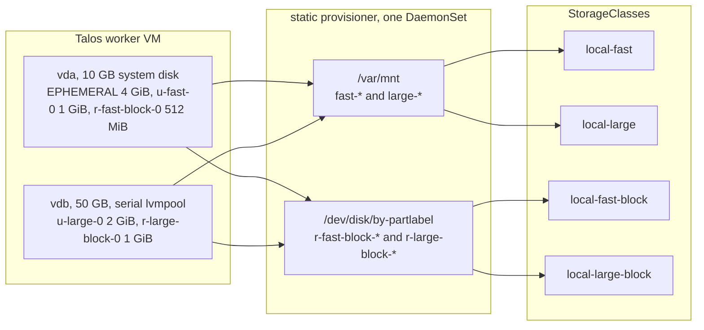

# Research: the node storage model on a lab cluster

Written 2026-10-05. The lab run behind decision 025 and `docs/node-storage.md`: slots named by tier on a Talos
worker, published by the static provisioner under the four local classes, consumed by ordinary pods and by Kata
pods. What ran, what came out, and what it changes in the design.

## The lab

One control plane and one worker, Talos 1.14.2 from the Image Factory with the `siderolabs/kata-containers`
extension, in QEMU on a workstation with nested KVM. Each VM has a 10 GB system disk and a 50 GB second disk whose
serial is `lvmpool`, the sizes the allowlisted `cluster-ctl` wrapper fixes. The worker's disk patch:

| Volume | Talos type | Disk | Size |
|---|---|---|---|
| EPHEMERAL | `VolumeConfig` | system | 4 GiB, `minSize` equal to `maxSize` |
| `fast-0` | `UserVolumeConfig`, xfs | system | 1 GiB |
| `fast-block-0` | `RawVolumeConfig` | system | 512 MiB |
| `large-0` | `UserVolumeConfig`, xfs | `disk.serial == "lvmpool"` | 2 GiB |
| `large-block-0` | `RawVolumeConfig` | `disk.serial == "lvmpool"` | 1 GiB |

The static provisioner is chart 2.8.0 with four classes: `local-fast` and `local-large` over `/var/mnt` by name
pattern, `local-fast-block` and `local-large-block` over `/dev/disk/by-partlabel` in Block mode. Every class is
`Retain` and `WaitForFirstConsumer`.

## Results

Every check passed. The worker is `slots-lab2-worker-1`, Talos 1.14.2, kernel 6.18.54, with the Kata extension
3.32.0 reported by `talosctl get extensions`.

**Talos laid out the slots as written.** `talosctl get volumestatus` on the worker:

| Volume | Partition | Size | Filesystem |
|---|---|---|---|
| EPHEMERAL | `/dev/vda4` | 4.3 GB | xfs |
| `r-fast-block-0` | `/dev/vda5` | 537 MB | none |
| `u-fast-0` | `/dev/vda6` | 1.1 GB | xfs, mounted at `/var/mnt/fast-0` |
| `r-large-block-0` | `/dev/vdb1` | 1.1 GB | none |
| `u-large-0` | `/dev/vdb2` | 2.1 GB | xfs, mounted at `/var/mnt/large-0` |

The selector `disk.serial == "lvmpool"` put both large slots on the second disk, which is how a disk a hypervisor
hands a VM is taken: by what the disk says about itself, never by a workload's name. `/dev/disk/by-partlabel`
carries a link per partition label, raw volumes included.

**The provisioner published one PV per slot, in the right class and mode:**

| PV | Class | Mode | Capacity | Path |
|---|---|---|---|---|
| `local-pv-4f3c0980` | `local-fast` | Filesystem | 960Mi | `/var/mnt/fast-0` |
| `local-pv-aec3d742` | `local-large` | Filesystem | 1984Mi | `/var/mnt/large-0` |
| `local-pv-5981168b` | `local-fast-block` | Block | 512Mi | `/dev/disk/by-partlabel/r-fast-block-0` |
| `local-pv-fe57593d` | `local-large-block` | Block | 1Gi | `/dev/disk/by-partlabel/r-large-block-0` |

Two classes read `/var/mnt` by name pattern and two read `/dev/disk/by-partlabel`, from one DaemonSet. A filesystem
PV reports the filesystem's capacity, so a 1 GiB slot is a 960Mi PV; a block PV reports the partition.

**Pods, in the order they ran:**

| Pod | Claim | What it showed |
|---|---|---|
| `fs-fast`, uid 26, non-root | `local-fast`, Filesystem | `/data` is `/dev/vda6` xfs, owned `root:26` with the setgid bit, the write succeeds: the kubelet applied `fsGroup`, no init container |
| `fs-large`, uid 26 | `local-large`, Filesystem | the same on `/dev/vdb2` |
| `blk-fast` | `local-fast-block`, Block | `/dev/slot` is a block device `251,5` of 536,870,912 bytes; 4 KiB written and read back equal |
| `kata-blk`, RuntimeClass `kata` | `local-large-block`, Block | the guest runs its own kernel, 6.18.35 against the node's 6.18.54; `/dev/slot` is `254,16`, a virtio-blk disk of 1 GiB; the round trip is equal |
| `kata-fs`, RuntimeClass `kata` | `local-large`, Filesystem | `/data` is `none on /data type virtiofs`; the write succeeds |
| `reserved` | `local-fast-block`, Block, selector `dataverket.org/reserved-for=reserved-db` | bound to the one PV carrying the label |

**Retain, then republish.** Deleting the `blk-fast` claim and the PV record made the provisioner publish the slot
again within ten seconds, under the same name, since the name is a hash of node, class and path. The slot came
back with its data, which is what `Retain` means: wiping is a person's step through Talos, since `talosctl wipe
disk` refuses a partition that is a volume until its config is removed. The
label went on the republished PV, and the selector claim bound to it and to nothing else.

**A Kata pod fits a 3 GiB worker.** The guest's default memory is 2 GiB, lazily allocated; the node ran the
provisioner, the CNI and the Kata pod at once.

## Findings on the way

- **Two classes over one directory need two container paths.** The provisioner's DaemonSet mounts each class's
  `hostDir`, and two mounts at `/var/mnt` are rejected by the API server. The chart's `mountDir` is the
  container-side path; `local-large` reads `/var/mnt` at `/mnt/local-large`, and its PVs still carry the host
  path. The same applies to the two Block classes over `/dev/disk/by-partlabel`.
- **`talosctl cluster create` wants EPHEMERAL of at least 3.8 GiB.** Its health check refuses a smaller one and
  retries until its timeout; a lab patch caps EPHEMERAL at 4 GiB. Production's 14 GiB is unaffected.
- **A patch must not set `machine.nodeLabels` in a `talosctl cluster create` lab.** The generator sets that field
  itself and the patch is rejected as "already set".

## What it changes

- The three open points in `docs/node-storage.md` are closed, and the page now states the two provisioner rules
  the lab found: a second class over a directory gets its own container path, and for a Block class that path
  must sit at the same depth as the host directory, because the partition labels are relative links (`../../vdb1`)
  and the provisioner resolves them inside the container. `/dev/disk/local-large-block` works;
  `/mnt/local-large-block` publishes nothing and logs "no such file or directory".
- Decision 025's audit records the lab run. Nothing in the decision changes.
- A `local-large-block` class joins the model wherever a large block slot exists; the name follows the same rule.
- The lab namespace needed `pod-security.kubernetes.io/enforce=privileged` because the test pods wrote to the raw
  device as root with `privileged: true`; a Block claim itself needs no privilege, and `kata-fs` ran unprivileged.

## Reproducing it

The lab files are kept in the session scratchpad and are not part of this repository: a scratch workspace that
satisfies the allowlisted `cluster-ctl`, the worker patch above, the provisioner values rendered with
`helm template` from chart 2.8.0, and the test manifests. A `talosctl cluster create` lab cannot cap EPHEMERAL below
3.8 GiB, since its health check refuses it, and its patches must not set `machine.nodeLabels`.
